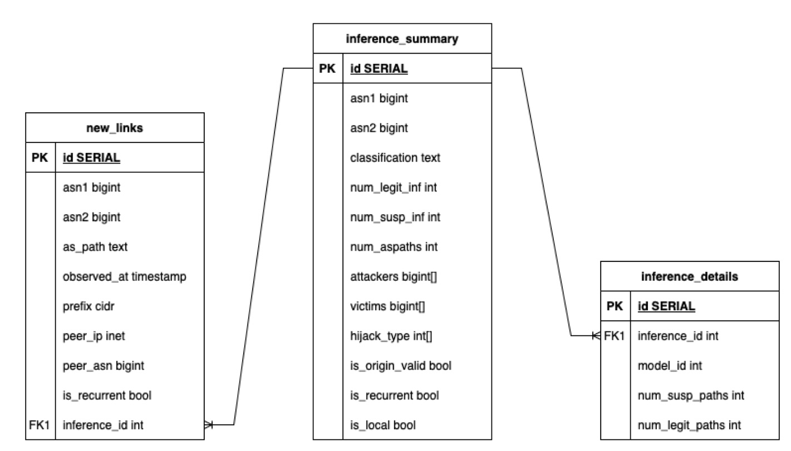

# 🚨 DFOH – Detecting Forged-Origin Hijacks

**DFOH** is a detector for *forged-origin BGP hijacks*. It processes BGP data and identifies suspicious new AS links using a combination of heuristics and inferences.

**DFOH** was presented at NSDI'24, you can read the [paper](https://www.usenix.org/conference/nsdi24/presentation/holterbach) to learn more about the system.

If you use this tool in your research or work, please cite us:

```
@inproceedings {295685,
author = {Thomas Holterbach and Thomas Alfroy and Amreesh Phokeer and Alberto Dainotti and Cristel Pelsser},
title = {A System to Detect {Forged-Origin} {BGP} Hijacks},
booktitle = {NSDI 24},
year = {2024},
}
```

---

## 🔧 Prerequisites

### 1. Clone the repository

```bash
git clone https://forge.icube.unistra.fr/tholterbach/bgproutes_dfoh.git
cd bgproutes_dfoh/runner/main
```

### 2. Install required tools

* [Docker](https://docs.docker.com/engine/install/ubuntu/)
* [PostgreSQL](https://www.postgresql.org/download/)
* Python dependencies:

```bash
pip install -r requirements.txt
```

---

## 📥 Download DFOH Auxiliary Data

DFOH relies on historical datasets (AS topology, IRR, PeeringDB, etc.) that are not included in this public repository and can take days or even weeks to collect, depending on your hardware.
If you prefer not to gather this data yourself, we’re happy to provide a snapshot of this historical database.

📩 Please contact the team at [contact@bgproutes.io](mailto:contact@bgproutes.io) to request this datasets. We typically transfer the compressed database via `scp` or `rsync`.
Feel free to prepare SSH access on your server in advance to speed up the process.

---

## 🗃️ Optional: Set Up a PostgreSQL Database

DFOH can store inference results in a PostgreSQL database (recommended for API usage). You can skip this section if you prefer local file output.

### 1. Create PostgreSQL user and database

```bash
sudo -i -u postgres
psql
```

Inside the PostgreSQL prompt:

```sql
CREATE USER your_user WITH PASSWORD 'your_password';
CREATE DATABASE inference_db OWNER your_user;
```

### 2. Configure environment variables

Create a `.env` file inside `bgproutes_dfoh/runner/main`:

```ini
DFOH_DB_NAME=your_database_name
DFOH_DB_USER=your_user
DFOH_DB_PWD=your_password
# Optional overrides
# DFOH_DB_HOST=your_host
# DFOH_DB_PORT=5432
```

### 3. Create the database tables

```bash
python3 build_results_db.py
```

Below is the database architecture:


### 4. Enable PostgreSQL Access from Local Docker Containers

Many components of DFOH run inside Docker containers, which need to connect to the local PostgreSQL instance running on the host. To allow this:

#### a. Update `postgresql.conf`

Edit the PostgreSQL configuration file (usually located at `/etc/postgresql/<version>/main/postgresql.conf` on Ubuntu):

```conf
listen_addresses = 'localhost,172.17.0.1'
```

> This setting tells PostgreSQL to accept connections from the default Docker bridge IP (`172.17.0.1`) in addition to `localhost`.

#### b. Update `pg_hba.conf`

Edit the client authentication file (typically at `/etc/postgresql/<version>/main/pg_hba.conf`) and add the following line:

```conf
host    all             all             172.17.0.0/16           md5
```

> This allows all Docker containers in the default bridge subnet to connect using password authentication (`md5`).

#### c. Restart PostgreSQL

After making these changes, restart the PostgreSQL service:

```bash
sudo systemctl restart postgresql
```

---

## 🔑 Set Up bgproutes.io API Access

1. Create an account at [bgproutes.io](https://bgproutes.io)
2. Generate an API key from your account dashboard.
3. If not done already, create a `.env` file inside `bgproutes_dfoh/runner/main`
4. Add the key to your `.env` file:

```ini
BGP_API_KEY=your_api_key
```

---

## ▶️ Running DFOH

You can now run DFOH using the `run_daily.sh` script. For example:

```bash
python3 run_daily.py --date 2025-07-09 --date_end 2025-07-10 --db_dir ~/db --store_results_in_db
```

Use the `--help` option for some help.

### ⏱️ Important Notes

* DFOH processes **one day at a time**.
* If storing in a DB, results will be persisted. If not, output is written to the local `db` directory.
* **Execution is time-consuming** – can take several hours per day.
* You must run DFOH on all intermediate days before your target day. For example, to analyze July 10, first process July 1 to 9.

---

## 📦 What Does DFOH Produce?
Depending on the chosen options, DFOH outputs its results either as files stored in the `new_edge/` and `cases/` directories within the specified database directory, and/or directly into a PostgreSQL database.


### 1. 🆕 New Edge Files (in `new_edge/`)

Each file lists newly observed AS links along with attributes.

#### Example line:

```csv
5089 210511,328474 328333 30844 3356 5089 210511,1652396649-195.60.172.0/24-102.67.56.1-328474,True
```

#### Column Descriptions:

* **C1**: AS link
* **C2**: AS path where the link was observed
* **C3**: Timestamp-Prefix-VP IP-ASN format
* **C6**: Whether the new edge is recurrent (seen often and suspicious)

---

### 2. 🧠 Inference Files (in `cases/`)

Each file lists DFOH's classification for new edges.

#### Example lines:

```
!sus 131958 264479 9 1 1 attackers:264479;victims:131958;type:1;valid_origin:True;recurrent:False;local:True
!leg 133968 134875 10 0 3 attackers:133968;victims:134875;type:1;valid_origin:True;recurrent:False;local:False
```

#### Columns:

* **C1**: `!sus` (suspicious) or `!leg` (legitimate)
* **C2/C3**: ASes in the new link
* **C4/C5**: # of legitimate vs suspicious votes
* **C6**: # of AS paths used
* **C7**: Metadata (attackers, victims, type, RPKI validity, etc.)

---

### 3. 🗃 PostgreSQL Tables (if enabled)

* **new\_links**: Same data as in new edge files.
* **inference\_summary**: Same data as in inference files.
* **inference\_details**: Inference results produced by various models, each configured with different false positive rate thresholds.

To serve results via API, see the README in the `public_api` folder.

---

## 🧠 Tips and Reminders

* 🐢 **First run takes time** – Docker pulls and prepares several containers.
* 🕒 **Running DFOH is resource-intensive** – expect hours per day even on 24-core, 64GB servers.
* 📅 **Weekly DB update** – datasets are updated every Sunday.
* 📜 **Check logs** – all logs are saved in the `logs/` directory.

---

## Code Contributors

The following individuals have contributed to the code in this repository:

- Thomas Holterbach (University of Strasbourg);
- Thomas Alfroy (University of Strasbourg);
- Olivier Bemba - Contributed during his internship at the University of Strasbourg (late May 2025 to early August 2025).

---

## Funding

This library was developed with the support of the following organizations and funding programs:

- [NGI Zero Core](https://nlnet.nl/core), a fund established by [NLnet](https://nlnet.nl) with financial support from the European Commission's [Next Generation Internet](https://ngi.eu) program. Learn more at the [NLnet project page](https://nlnet.nl/project/BGP-ForgedOrigin).

[](https://nlnet.nl)
[](https://nlnet.nl/core)

- A grant from the Internet Society, through the MANRS Initiative, and Région Grand Est.
- Funding from the ArtIC project – Artificial Intelligence for Care (grant ANR-20-THIA-0006-01), co-funded by:
	•	Région Grand Est
	•	Inria Nancy – Grand Est
	•	IHU Strasbourg
	•	University of Strasbourg
	•	University of Haute-Alsace
- A research grant from the Cisco University Research Program Fund, an advised fund of the Silicon Valley Community Foundation.